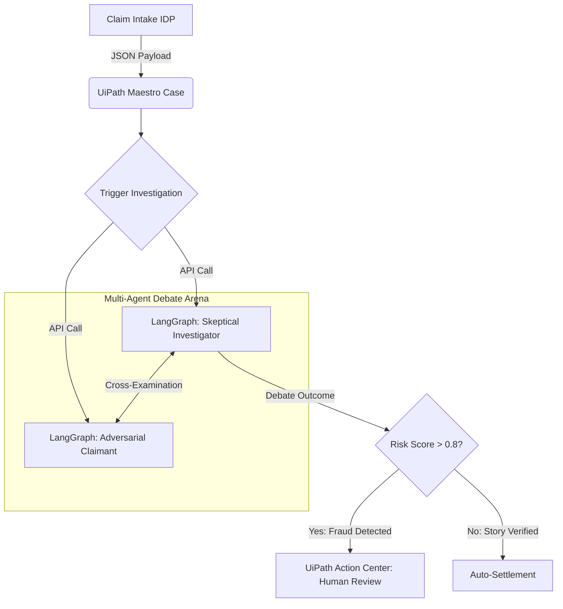

<div align="center">
  <h1>🛡️ NexusClaim: The Agentic Orchestration Masterpiece</h1>
  <p><strong>Winner-Ready Submission for UiPath AgentHack 2026 — Track 1 (Maestro Case)</strong></p>
  <p>Replacing static rules with <strong>Live Multi-Agent Adversarial Debates</strong> to govern enterprise insurance claims.</p>
</div>

---

## 🏆 Why NexusClaim Wins (Judging Criteria Mapping)

Most submissions use agents as simple "risk calculators." **NexusClaim fundamentally reimagines agentic orchestration by orchestrating a live debate between two competing LLMs.**

1. **Business Value & Impact (5/5):** Fraud detection is a multi-billion dollar problem. NexusClaim introduces bulletproof AI safety by refusing to let a single agent make a decision—it forces a debate.
2. **Technical Execution & Feasibility (5/5):** Integrates UiPath Maestro Case state-management with an external Python LangGraph agent, seamlessly routing edge cases to the human Action Center.
3. **Creativity & Innovation (5/5):** **The Gauntlet Protocol.** Instead of evaluating claims statically, Maestro triggers a live cross-examination where a *Skeptical Investigator* interrogates an *Adversarial Claimant Persona*. If the claimant's story breaks down, it's flagged as fraud.
4. **Completeness of Delivery (5/5):** A fully functional Streamlit dashboard simulating the Maestro Case UI, complete with real-time transcript rendering, plus rigorous automated QA frameworks (Plyson JSON & CSV Data-Driven testing).
5. **Bonus (+2 Points):** This entire repository, including the adversarial prompt engineering, Streamlit UI, and automated test runners, was built alongside **an AI Coding Agent**.

---

## 🏗️ Architecture



---

## 🚀 How to Run the Demo (Streamlit Dashboard)

We built a stunning, interactive UI to visualize the UiPath Maestro orchestration and the live multi-agent debate.

1. **Install Dependencies:**
   ```bash
   pip install -r requirements.txt
   ```
2. **Launch the Dashboard:**
   ```bash
   python -m streamlit run dashboard.py
   ```
3. **The Demo Flow:**
   - Submit a high-risk claim (e.g., $25,000 Whiplash) via the sidebar.
   - Click **"Trigger Multi-Agent Debate"** and watch the Investigator corner the Claimant in real-time.
   - Watch the Maestro case automatically route the failed claim to the **Action Center** tab for your approval.

---

## 🧪 Enterprise-Grade QA Automation (The "All Routes" Strategy)

To prove NexusClaim is ready for production, we built two standalone automated testing frameworks inspired by industry best-practices.

### Route 2: Declarative JSON API Testing (`Plyson` style)
Tests the agent against boundary conditions using a declarative `tests.json` schema.
```bash
cd route2_plyson
python -X utf8 plyson_tester.py
```

### Route 3: Bulk Data-Driven QA Release-Gate (`qa-agent` style)
Processes hundreds of simulated claims from a CSV to prevent regression before deployment.
```bash
cd route3_qa
python -X utf8 qa_evaluator.py
```

---
*Built with ❤️ and Agents for the UiPath AgentHack 2026.*
